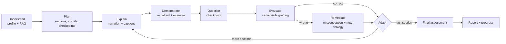
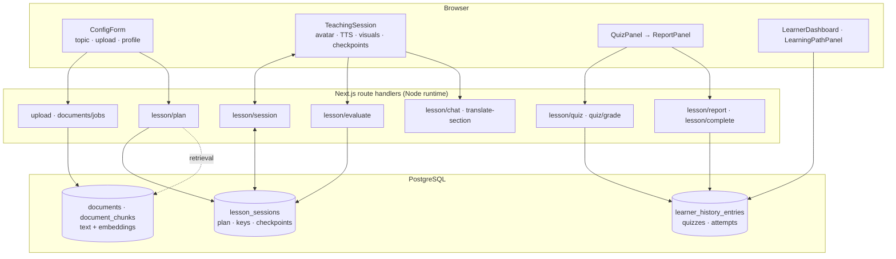

# Aetheris AI

**A human-like AI educator that teaches through video.**

🔗 Live demo: [ai-teacher-mu-seven.vercel.app](https://ai-teacher-mu-seven.vercel.app)

Built for the AI Innovation Hackathon 2026 — Round 2 ("AI Teacher" challenge).

---

## Problem Statement

Digital learning gives you two things: pre-recorded lectures that cannot see you, and chatbots that answer whatever you happen to ask. Neither *teaches*. A lecture does not notice that you missed the third step; a chatbot has no lesson plan, no sense of what it has already covered, and no opinion about what you should learn next.

What is missing is the thing a human tutor does: plan a lesson for **this** learner, explain it, stop and check whether it landed, work out *why* it did not, explain it a different way, and only then move on.

## Solution Overview

Aetheris AI is a full-stack Next.js application that runs a complete taught lesson. A learner names a topic or uploads their own material, states their level, language, and how long they have, and the system:

1. **Understands** — retrieves the passages of the uploaded document that actually bear on the topic (hybrid lexical + vector RAG), or works from general knowledge for a bare topic.
2. **Plans** — one LLM call produces a structured, multi-section lesson sized to the learner's time budget, in their language, at their level, choosing a subject-appropriate visual for every section.
3. **Explains & demonstrates** — an animated teacher presents each section as a video-style lesson: spoken narration, live captions, a rendered visual aid, and a worked example.
4. **Questions** — sections carry checkpoint questions the learner answers inline.
5. **Evaluates** — the server grades the answer against a key the browser never sees, and names the specific misconception behind a wrong one.
6. **Adapts** — a run of correct answers raises the challenge; a run of wrong ones makes the teaching simpler and more concrete. The learner can see it happening.
7. **Continues** — through remediation or on to the next section, then a final assessment, a report, and a persistent progress record.

## Why Aetheris Is Different

- **It is a lesson, not a conversation.** The lesson plan is a first-class object with sections, visuals, checkpoints and answer keys. The learner is taught through it; they do not have to know what to ask.
- **The teaching adapts visibly.** Adaptation is an explicit, inspectable policy over the checkpoint outcomes the *server* recorded, and the stance it picks is shown on screen ("Simplifying", "Raising the challenge") rather than silently applied.
- **The server owns the truth.** Answer keys, grading, progress, mastery and the lesson's own state live on the server. Nothing the browser sends can change a mark. This is unusual for a hackathon build and it is what makes the assessment worth anything.
- **No vendor lock, no per-minute avatar bill.** The avatar, the voice and the video export are all browser-native. Embeddings run in-process. The only paid dependency is the LLM, and it is pluggable.
- **It degrades honestly.** No voice for Marathi on this device? The lesson says so and keeps running at reading pace. A document with nothing relevant in it? It says that too, instead of teaching from the ten least-irrelevant paragraphs.

## Key Features

| # | Hackathon requirement | Where it lives |
|---|---|---|
| 1 | Learning from uploaded material | [`documentParser.ts`](src/lib/documentParser.ts), [`vectorStore.ts`](src/lib/vectorStore.ts), [`/api/upload`](src/app/api/upload/route.ts), [`ingestion/jobs.ts`](src/lib/ingestion/jobs.ts) |
| 2 | Topic-based teaching | [`/api/lesson/plan`](src/app/api/lesson/plan/route.ts) with no `docId` |
| 3 | AI-generated lesson structure | `planLesson()` in [`teachingAgent.ts`](src/lib/teachingAgent.ts) |
| 4 | Personalized teaching | Level, language, minutes, objective and style threaded through every prompt |
| 5 | Human-like teaching interaction | [`TeachingSession.tsx`](src/components/TeachingSession.tsx) + the server-owned state machine in [`lessonState.ts`](src/lib/lessonState.ts) |
| 6 | Video-based AI teacher | Animated [`Avatar.tsx`](src/components/Avatar.tsx) + synced [`SlideRenderer.tsx`](src/components/SlideRenderer.tsx); real `.webm` export via [`VideoRecorder.tsx`](src/components/VideoRecorder.tsx) |
| 7 | AI voice | Web Speech API through the state machine in [`speech/`](src/lib/speech/) |
| 8 | Human-like AI avatar | [`Avatar.tsx`](src/components/Avatar.tsx) — head-and-shoulders SVG with six teaching expressions, blinking, gaze and breathing |
| 9 | Multilingual | 22 languages; content authored *in* the language, plus a live mid-lesson switch |
| 10 | Questioning & assessment | In-lesson checkpoints + an end-of-lesson quiz ([`QuizPanel.tsx`](src/components/QuizPanel.tsx)), both graded server-side |
| 11 | Adaptive response | Misconception detection + the stance policy in [`adaptation.ts`](src/lib/adaptation.ts) |
| 12 | Working prototype | This app — see Setup |

## Human-Like Teaching Flow



Every transition is a named command applied to a server-owned session, version-checked so a stale tab cannot move the lesson.

## System Architecture



**The browser renders; the server decides.** The lesson plan (with its answer keys), the current section, every checkpoint outcome, the quiz, the grade and the completion all live in `lesson_sessions` and are changed only through validated commands.

## Tech Stack

| Layer | Choice |
|---|---|
| Framework | Next.js 16.3.3 (App Router), React 19.2.8, TypeScript (strict) |
| Styling | Tailwind CSS v4, Material Design 3–inspired tokens in `globals.css` |
| Auth | Auth.js / next-auth v5 beta, JWT sessions, PostgreSQL adapter, Google OAuth + email/password |
| Database | PostgreSQL (Neon on the hosted demo), `pg`, versioned SQL migrations |
| LLM | Groq (default) or Google Gemini, pluggable via `LLM_PROVIDER`, with failover and a circuit breaker |
| Embeddings | `@xenova/transformers` running `Xenova/all-MiniLM-L6-v2` in-process (ONNX, CPU, no API) |
| Rendering | KaTeX (equations), Mermaid (diagrams), Prism (code), custom canvas plotter (graphs) |
| Voice | Browser Web Speech API |
| Video | Browser `getDisplayMedia` + `MediaRecorder` |
| Testing | Node's built-in `node:test` with native TypeScript type stripping — no test framework dependency |

## AI / LLM Implementation

A pluggable provider layer ([`llm.ts`](src/lib/llm.ts), [`providers/`](src/lib/providers/)) selected by `LLM_PROVIDER`. Shared across both providers:

- **Strict JSON contracts.** Every model response is parsed by a fenced-code-tolerant extractor and then validated with a Zod schema ([`schemas/model.ts`](src/lib/schemas/model.ts)). A malformed response gets one bounded repair attempt inside the retry loop, not a crash.
- **One end-to-end deadline** per request, set below the route's own ceiling, so a slow provider fails cleanly instead of being killed mid-write.
- **Automatic failover** to the other provider when one is configured, with a **circuit breaker** ([`circuitBreaker.ts`](src/lib/providers/circuitBreaker.ts)) that opens immediately on permanent failures (bad key, exhausted quota) and after a run of transient ones.
- **Per-user budgets**: 20 model requests/minute and 300/day across all model routes.

## RAG & Knowledge Grounding

- **Extraction** — PDF (`pdf-parse`), DOCX (`mammoth`), PPTX (OOXML slide XML via `jszip` + `xml2js`), TXT, MD. PPTX extraction records the slide each passage came from.
- **Chunking** ([`chunk.ts`](src/lib/chunk.ts)) — ~900-character paragraph-aware chunks with overlap at every paragraph boundary; a slide marker is a hard cut so no chunk spans two sources.
- **Embedding** — in-process, batched, and every vector records the model that produced it, so changing models makes old vectors invisible rather than silently comparable.
- **Ingestion is a durable job** ([`ingestion/jobs.ts`](src/lib/ingestion/jobs.ts)) with checkpoints, attempt limits and heartbeats. A slice that dies costs one slice; the next resumes from `next_chunk_index`.
- **Retrieval is hybrid** ([`vectorStore.ts`](src/lib/vectorStore.ts), [`retrieval/fusion.ts`](src/lib/retrieval/fusion.ts)) — a PostgreSQL full-text lexical arm and a vector arm, combined by **Reciprocal Rank Fusion**, then filtered by a **relevance floor** and a per-source cap so one slide cannot fill the context.
- **Honest fallback** — if nothing clears the floor, the lesson is taught from general knowledge and says so, rather than being "grounded" in irrelevant text.
- **Provenance** — the retrieved chunk ids, their source labels and their scores are stored on the session.

## Prompt / Agent Architecture

One function per pedagogical responsibility in [`teachingAgent.ts`](src/lib/teachingAgent.ts), each a single narrowly-scoped prompt — no orchestration framework, which keeps latency and failure modes predictable:

| Function | Responsibility |
|---|---|
| `parseInstruction` | free text → structured learner profile |
| `planLesson` | the lesson: sections, visuals, examples, checkpoints, keys |
| `evaluateAnswer` | correctness + misconception + remediation, **adapted to the current stance** |
| `answerQuestion` | Ask Teacher, anchored to the current section, never graded |
| `translateSection` | re-express one section in a new language, ids and structure preserved |
| `generateQuiz` / `generateReport` | final assessment and feedback |
| `generateLearningPath` | multi-step curriculum for a broad topic |

Untrusted text (documents, learner answers, retrieved passages) is fenced with an unforgeable delimiter before it enters a prompt.

## Personalization

The learner sets **level** (beginner/intermediate/advanced), **language**, **available time** (5 / 20 / 60 minutes), **teaching style**, and an optional **objective** — or types a sentence like *"Teach me Chapter 4 in 20 minutes in Hindi"* and `parseInstruction` fills the form in.

Time budget drives depth directly (2–3 sections for 5 minutes, 7–10 for 60). Returning learners see their accumulated strong and weak concepts, drawn from their server-side history.

## Adaptive Teaching

[`adaptation.ts`](src/lib/adaptation.ts) is a small, legible policy — deliberately not a learning system — over the last four checkpoint outcomes **the server recorded**:

| Signal | Stance | What changes |
|---|---|---|
| 2+ correct in a row | **Raising the challenge** | Feedback gets brief, the re-explanation is skipped, and the teacher ends with an extension question — an edge case or application |
| 2+ wrong in a row | **Simplifying** | The failed explanation is *not* repeated; the idea is broken into its smallest step with an everyday example and real numbers, and less prior knowledge is assumed |
| otherwise | **On track** | Normal pace: name the misconception, re-explain a different way |

Two rules keep it safe: it never moves the learner off the level they chose (a strong beginner gets a harder *beginner* question, not an intermediate one), and it never shifts on a single answer. The stance is shown as a chip beside the section counter, so the adaptation is visible rather than merely felt.

## Multilingual Architecture

22 languages. Content is **authored in** the target language rather than translated afterwards, so an English textbook can be taught in Hindi. Mid-lesson, changing the dropdown re-expresses **every** section and rewrites the lesson's own transcript bubbles in place — the caption, the active checkpoint and the earlier lesson content all move together. The learner's own answers are never rewritten.

Concurrent switches are generation-guarded and aborted, so a slow batch cannot land under a newer language.

## Voice / TTS

Browser-native **Web Speech API** — no key, no cost, no network. Narration is an explicit state machine ([`speech/controller.ts`](src/lib/speech/controller.ts)) that guarantees every `await speak(...)` returns, and reports *why* it finished, so cancelling can never be mistaken for finishing.

Voices come from the operating system, so not every language can be narrated on every device. When none matches, the lesson runs on a **silent narration engine** ([`speech/silentEngine.ts`](src/lib/speech/silentEngine.ts)) — same lifecycle, on a reading-paced timer — so the timeline, pause/resume, checkpoints and completion all behave normally and only the audio is missing. The UI says so, and the avatar does not mime speech nobody can hear.

## AI Avatar / Teaching Video

The avatar is an inline SVG teacher — head, shoulders and collar — with six teaching states: **idle, speaking, listening, thinking, correct, wrong**. Eyebrows, mouth curve and gaze interpolate between them; blinking is irregular; breathing and a subtle lecturing sway are CSS animations, so the global `prefers-reduced-motion` rule switches all of it off. The mouth is driven by the live speech state.

The **live lesson itself** — avatar, narration, captions and the rendered visual, advancing section by section — is the video-based teaching experience. In addition, **"Record teaching video"** captures the tab (video *and* narration audio) through `getDisplayMedia` + `MediaRecorder` and produces a real downloadable `.webm`, bounded at 30 minutes / 512 MB. No avatar vendor, no per-minute cost.

## Visual Explanation Engine

The planner picks a visual per section and [`SlideRenderer.tsx`](src/components/SlideRenderer.tsx) renders it:

| Type | Renderer | Typical subject |
|---|---|---|
| `equation` | KaTeX (`trust: false`, expansion-limited) | maths, physics |
| `graph` | Custom canvas plotter with an allow-listed expression parser | functions, calculus |
| `mermaid` | Mermaid in `securityLevel: "strict"`, HTML labels off, then DOMPurify | processes, architecture |
| `code` | Prism | programming |
| `timeline` | Custom component | history, sequences |
| `markdown` | react-markdown + GFM | everything else |

The graph plotter evaluates expressions with a hand-written tokeniser and recursive-descent parser over a 27-function allow-list — **no `eval`, no `new Function`**.

## Assessment Methodology

Two layers, both server-authoritative:

1. **In-lesson checkpoints** — graded by `evaluateAnswer` against a key held on the server. The outcome is written to the session as a command; the browser's claim about correctness is never trusted.
2. **End-of-lesson quiz** — generated from the concepts actually taught. MCQs are graded deterministically **by option id**; short answers go through the same rubric-versioned evaluator. The learner's copy of the quiz has the key removed field-by-field before it is sent.

The report returns score %, strong areas, weak areas, incorrect concepts, a recommendation and a **suggested next topic** — with the stored score overriding whatever the model reports. Grades are evidence-backed: each attempt stores the question, the answer, the verdict and the `grader_version` / `rubric_version` that produced it.

## Student Progress / Learning Profile

Completing a lesson commits, in **one transaction**, the history row, the learning-path advance and the session's completion — recorded under the topic, language and subject carried by the server-owned session. The write is idempotent, so a retry after a dropped response reports a replay rather than writing a second copy.

Progress survives reload and follows the account, not the browser. `/api/lesson/session` restores a lesson in flight, including the section it reached and its transcript.

## Security

| Control | Where |
|---|---|
| Nonce + hash CSP, `strict-dynamic`, no `unsafe-inline`/`unsafe-eval` for scripts | [`security/headers.ts`](src/lib/security/headers.ts), [`proxy.ts`](src/proxy.ts) |
| Every handler authenticates and authorizes itself | [`apiGuard.ts`](src/lib/apiGuard.ts) |
| Answer keys and grading server-side only | [`grading.ts`](src/lib/grading.ts), [`lessonState.ts`](src/lib/lessonState.ts) |
| Zod validation at every trust boundary | [`schemas/`](src/lib/schemas/) |
| Upload limits: size, MIME magic number, zip-bomb ratio, entry count | [`security/uploads.ts`](src/lib/security/uploads.ts) |
| Rate limits per route, per user, per day | [`security/rateLimit.ts`](src/lib/security/rateLimit.ts) |
| Allow-listed maths parser instead of `new Function` | [`security/mathExpression.ts`](src/lib/security/mathExpression.ts) |
| Mermaid strict + DOMPurify SVG allow-list | [`security/diagram.ts`](src/lib/security/diagram.ts) |
| Verified DB TLS; insecure mode refused in production | [`db/ssl.mjs`](db/ssl.mjs) |
| Open-redirect-safe callbacks | [`security/callbackUrl.ts`](src/lib/security/callbackUrl.ts) |
| Optimistic version checks on every mutation | [`lessonSessionStore.ts`](src/lib/lessonSessionStore.ts) |

Errors carry a request id; internal detail, SQL and provider text stay server-side. See [`docs/OPERATIONS.md`](docs/OPERATIONS.md) and [`docs/REMEDIATION-LEDGER.md`](docs/REMEDIATION-LEDGER.md).

## Setup Instructions

Requires **Node ≥ 22.6** (the test runner uses native TypeScript type stripping) and a PostgreSQL database.

```bash
git clone <repo> && cd ai-teacher
npm install
cp .env.local.example .env.local
# Fill in: GROQ_API_KEY (or GEMINI_API_KEY with LLM_PROVIDER=gemini),
#          DATABASE_URL, AUTH_SECRET  (openssl rand -base64 32)
npm run migrate -- --status   # what is pending
npm run migrate               # apply it
npm run dev                   # http://localhost:3000
```

Quality gates:

```bash
npm run check   # eslint + tsc --noEmit + the full test suite
npm run build   # production build
```

## Environment Variables

| Variable | Required | Purpose |
|---|---|---|
| `DATABASE_URL` | **yes** | PostgreSQL connection string |
| `AUTH_SECRET` | **yes** | Auth.js session signing key |
| `GROQ_API_KEY` | one of | LLM inference (default provider) |
| `GEMINI_API_KEY` | one of | LLM inference when `LLM_PROVIDER=gemini` |
| `LLM_PROVIDER` | no | `groq` (default) or `gemini` |
| `LLM_FALLBACK_PROVIDER` | no | The other provider, for automatic failover |
| `GOOGLE_CLIENT_ID` / `GOOGLE_CLIENT_SECRET` | no | Enables "Continue with Google"; unset hides the button rather than breaking it |
| `AUTH_TRUST_HOST` | **if self-hosting behind a proxy** | Tells Auth.js to trust the forwarded host |
| `DATABASE_CA_CERT` | no | Private CA for the database's TLS certificate |
| `DATABASE_POOL_MAX`, `DATABASE_*_TIMEOUT_MS` | no | Connection pool bounds (default 10) |
| `MODEL_TEMPERATURE`, `LLM_TIMEOUT_MS`, `LLM_MAX_ATTEMPTS` | no | Generation tuning |
| `EMBEDDING_MODEL` | no | Defaults to `Xenova/all-MiniLM-L6-v2` |
| `RETRIEVAL_TOP_K`, `RETRIEVAL_MIN_SCORE`, `RETRIEVAL_MAX_PER_SOURCE` | no | Retrieval tuning |
| `DOCUMENT_RETENTION_DAYS` | no | Sweep age for `npm run retention` (default 90) |

Never commit `.env.local`. `.env.local.example` contains placeholders only.

## Database / Migrations

Versioned, immutable, forward-only SQL in `db/migrations/`, applied by `npm run migrate`:

| Migration | Adds |
|---|---|
| `0001_baseline` | accounts, documents, chunks, learner history, learning path |
| `0002_quiz_grading` | `lesson_quizzes`, `lesson_quiz_attempts` |
| `0003_constraints` | `NOT VALID` CHECK constraints (including `learner_history_topic_not_blank`) |
| `0004_lesson_sessions` | `lesson_sessions` + a partial unique index enforcing one live lesson per learner |
| `0005_retrieval` | chunk `source`, `embedding_model`, GIN full-text index, session `sources` |
| `0006_ingestion_jobs` | `ingestion_jobs`, document ingest status |

`db/optional/0001_pgvector.sql` is written but **deliberately not in the migration path** — it needs the extension and a decision. The runner refuses to continue if an already-applied migration file has been edited; add a new one instead.

## Deployment Instructions

1. Push to GitHub and import the repository into Vercel (or any Node host).
2. Set every **required** environment variable above in the host's project settings.
3. Add the production callback to the Google OAuth client: `https://<your-domain>/api/auth/callback/google`.
4. Run `npm run migrate` against the production `DATABASE_URL` **once**, from a machine that can reach it.
5. Deploy. Every page is server-rendered per request (a nonce-based CSP cannot be applied to a page prerendered at build time), so there is no build-time page cache to invalidate.

## Demo Flow

See [`docs/DEMO_SCRIPT.md`](docs/DEMO_SCRIPT.md) for a timed 5-minute walkthrough. In short: configure → plan → watch the teacher → answer a checkpoint **wrong on purpose** → watch it adapt → ask a question → switch language mid-lesson → final assessment → report → progress.

## Known Limitations

Stated plainly, because a judge will find them anyway:

- **Legacy `.doc` and `.ppt` are not supported** — only `.pdf`, `.docx`, `.pptx`, `.txt`, `.md`. The file picker offers exactly what the parser handles.
- **Ask Teacher is grounded in the current lesson section, not re-retrieved from the document.** The lesson is document-grounded; a follow-up question is answered from that section's context.
- **Vector search runs in Node**, not in the database. `db/optional/0001_pgvector.sql` is written and waiting on a decision; the lexical arm keeps retrieval working meanwhile.
- **Embeddings are English-oriented** (`all-MiniLM-L6-v2`). The multilingual model is a one-variable swap that invalidates every stored vector, so it is a deliberate decision rather than a default.
- **Ingestion has no background worker.** The job is durable and resumable, but its slices are driven by the browser polling. Closing the tab pauses indexing rather than losing it.
- **Rate limits and circuit breakers are per process**, so N instances means up to N× the configured limit.
- **TTS voice coverage depends on the operating system.** On a stock macOS install, 17 of 22 languages resolve to a voice; the rest run silently at reading pace.
- **No automated browser tests.** 509 unit and integration tests cover the state machines, security controls and route contracts; component and accessibility testing needs a browser harness that is not set up.
- **No email provider**, so password reset and email verification are not implemented.

## Future Work

- pgvector, moving similarity search into the database.
- A multilingual embedding model, so retrieval works as well in Hindi as in English.
- A queue and worker for ingestion, replacing the client-driven trigger.
- Speech-to-text for spoken answers, closing the loop on a genuinely conversational lesson.
- Playwright coverage of the lesson journey, plus automated `axe` checks.

## Third-Party APIs, Libraries and Models

**Paid / external services**

- **Groq** or **Google Gemini** — LLM inference. One API key required.
- **PostgreSQL** (Neon on the hosted demo) — the only datastore.
- **Google OAuth** — optional sign-in.
- **Google Fonts** — Inter, Montserrat, Material Symbols.

**Models**

- LLM: whichever the provider serves (`GROQ_MODEL` / `GEMINI_MODEL` override the defaults).
- Embeddings: `Xenova/all-MiniLM-L6-v2`, downloaded once and run locally on CPU.

**Libraries**

`next`, `react`, `next-auth`, `@auth/pg-adapter`, `pg`, `zod`, `@xenova/transformers`, `pdf-parse`, `mammoth`, `jszip`, `xml2js`, `mermaid`, `dompurify`, `katex`, `prismjs`, `react-markdown`, `remark-gfm`, `remark-math`, `rehype-katex`, `bcryptjs`, `tailwindcss`.

**Runs in the browser with no service behind it**: Web Speech API (voice), `getDisplayMedia` + `MediaRecorder` (video export), Mermaid / KaTeX / Prism (rendering).
